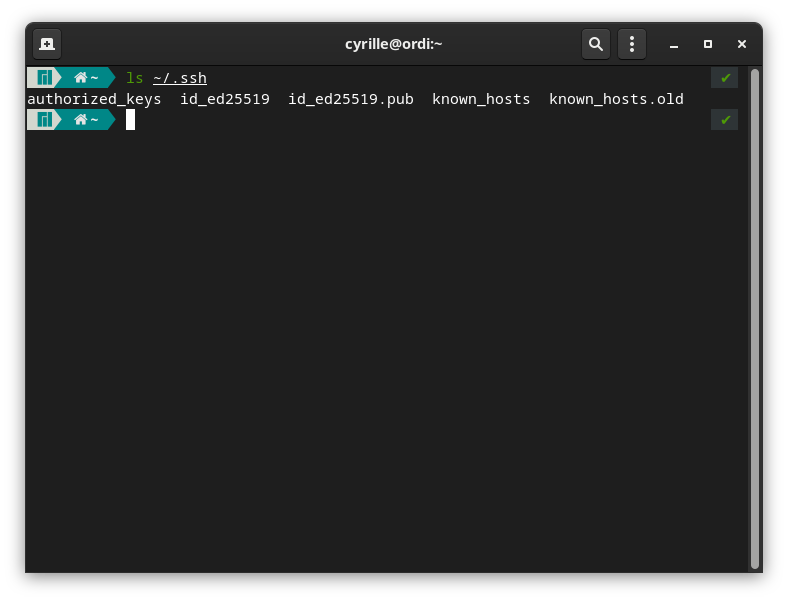
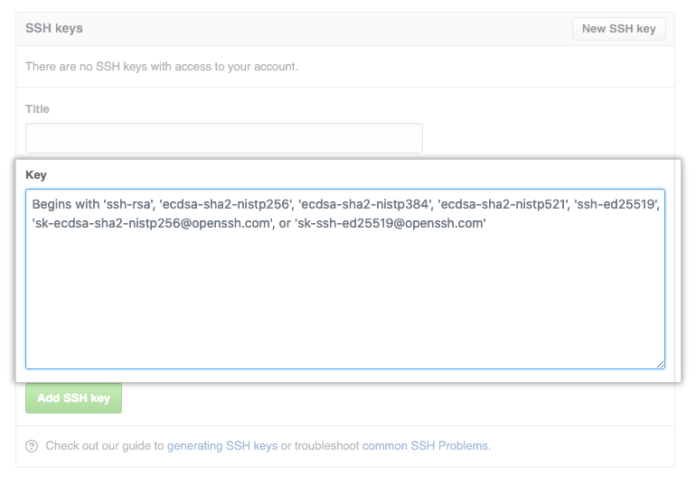
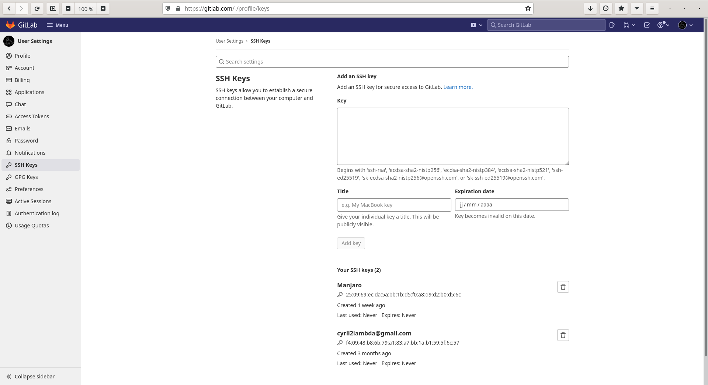

# SSH: защищённое соединение

---
## [Continuous Integration](/ci)
---

Начиная с этого момента мы будем много взаимодействовать с GitHub. Для этого нам придётся соблюсти одно из фундаментальных правил современной веб-разработки: использовать защищённое соединение при общении с каким-бы то ни было удалённым сервером. А репозиторий GitHub – это и есть удалённый сервер. Также, забегая вперёд, нельзя не отметить, что для непрерывной доставки нам понадобится ещё один удалённый сервер, на котором будет развёрнуто приложение.

Установить защищённое соединение нам поможет протокол SSH.

---

SSH (Secure SHell) – это сетевой протокол прикладного уровня для управления операционной системой и туннелирования TCP-соединений. Обратите внимание на то, что SSH – это протокол, а не одна-единственная программа. Для работы SSH необходимы, как минимум, две программы: сервер и клиент.

Клиенты при подключении обязаны аутентифицироваться по паролю или с помощью пары ключей. Аутентификация по паролю подвержена атакам, поэтому она используется лишь при первичной настройке сервера, пока ключей ещё нет, и участники соединения ещё ничего не знают друг о друге. На любом же промышленном сервере используется аутентификация исключительно с помощью ключей. Пара ключей реализует алгоритм асинхронного шифрования. При асинхронном шифровании у каждого клиента есть приватный и публичный ключ; сочетание этих ключей идентифицирует клиента. Приватный ключ должен храниться в строжайшем секрете у клиента, а публичный ключ должен быть заранее известен серверам, к которым клиент подключается. Если вы раскрыли приватный ключ, вы должны незамедлительно принять меры: любой обладатель приватного ключа может выдать себя за вас.

## Установка SSH-утилит

Набор SSH-утилит по умолчанию включён в большинство операционных систем.

Популярные дистрибутивы Linux (Ubuntu, Fedora, Manjaro) уже содержат все необходимые утилиты в виде пакета openssh или openssh-server и т. п.

OpenSSH включён в Windows 10 версии 1809 и выше. SSH также будет доступен после установки Git Bash.

MacOS, начиная с Snow Leopard, также содержит набор SSH-утилит.

Проверьте наличие утилит, выполнив команду

```bash
ssh -V
# OpenSSH_8.8p1, OpenSSL 1.1.1m  14 Dec 2021
```

## Генерация ключей

Для генерации ключей нам понадобится утилита ssh-keygen.

Выполните следующую команду, подставив вместо your_email@example.com ваш email.

```bash
ssh-keygen -t ed25519 -C "your_email@example.com"
```

Параметр -t задаёт алгоритм шифрования; ed25519 – это современный и надёжный алгоритм, но, если ваша система по какой-то причине не поддерживает его, воспользуйтесь алгоритмом rsa.

```bash
ssh-keygen -t rsa -b 4096 -C "your_email@example.com"
```

Параметр -b задаёт количество бит в ключе. Чем больше бит используется, тем надёжнее будет ключ.

Утилита поинтересуется, где сохранить пару ключей. Оставьте значение по умолчанию, чтобы не производить серию дополнительных настроек.

> \> Enter a file in which to save the key (/home/you/.ssh/algorithm): [Press enter]

По указанному пути будут созданы два файла: приватный и публичный ключ. По-умолчанию приватный ключ примет название вида id_<algorithm>, а публичный – id_<algorithm>.pub.

Далее вам предложат добавить фразу доступа (passphrase). Фраза доступа выполняет роль пароля и обеспечивает дополнительный уровень безопасности; она будет запрошена при каждом соединении. Даже если злоумышленник заполучит ваш приватный ключ, ему понадобится ваша фраза доступа, чтобы получить доступ к устройству. Вы можете оставить пустую фразу доступа, но помните, что на настоящем промышленном сервере она обязана быть.

После этого вы можете полюбоваться созданными ключами в директории, указанной при их создании.



## ssh-agent

При каждом соединении по SSH, вам придётся вводить фразу доступа (или пароль от сервера, если вы не используете ключи). Такое поведение – терпимо, но быстро надоедает, когда нужно выполнить много команд. Если вы готовы это терпеть, можете пропустить этот шаг.

ssh-agent – это утилита-менеджер ключей SSH. Он работает в фоновом режиме и хранит ключи и сертификаты, готовые к использованию, в памяти в незашифрованном виде. Чтобы запустить агент, выполните команду

```bash
eval "$(ssh-agent -s)"
```

Добавьте ранее созданный приватный ключ с помощью утилиты ssh-add, например:

```bash
ssh-add ~/.ssh/id_ed25519
```
Теперь вам реже придётся вводить пароль или фразу доступа.

## Добавление SSH-ключа в GitHub

Мы будем выгружать код в репозитории GitHub. В этом случае GitHub будет выступать в качестве SSH-сервера, а компьютер, с которого выполняется команда git push, примет роль SSH-клиента. Чтобы добавить SSH-ключ в ваш аккаунт GitHub, сперва перейдите в настройки профиля.


В разделе “Access” перейдите в пункт “SSH and GPG keys” и нажмите на кнопку “New SSH key”.


В поле “Title” задайте любое удобное для вас название, например, “Домашний компьютер”. В поле “Key” необходимо добавить содержимое публичного ключа (файл с окончанием .pub): просто скопируйте и вставьте содержимое файла.



Подтвердите добавление ключа, нажав на “Add SHH key”.

Теперь вы можете взаимодействовать с GitHub-репозиторием по SSH. Интересно, что GitLab, альтернатива GitHub, с недавних пор поддерживает соединение исключительно по SHH или через систему токенов. Возможно, вы недавно пытались выполнить команду git push в репозиторий GitLab из консоли, у вас ничего не получалось, а в консоль выводилось что-то про http. Теперь вы знаете что делать: добавить SSH-ключ в GitLab!



---

В этой главе мы познакомились с протоколом и несколькими утилитами SSH, создали пару ключей и добавили их в GitHub. Теперь мы готовы разместить наш проект в GitHub.

## [SSH: защищённое соединение](/ci/ssh)
