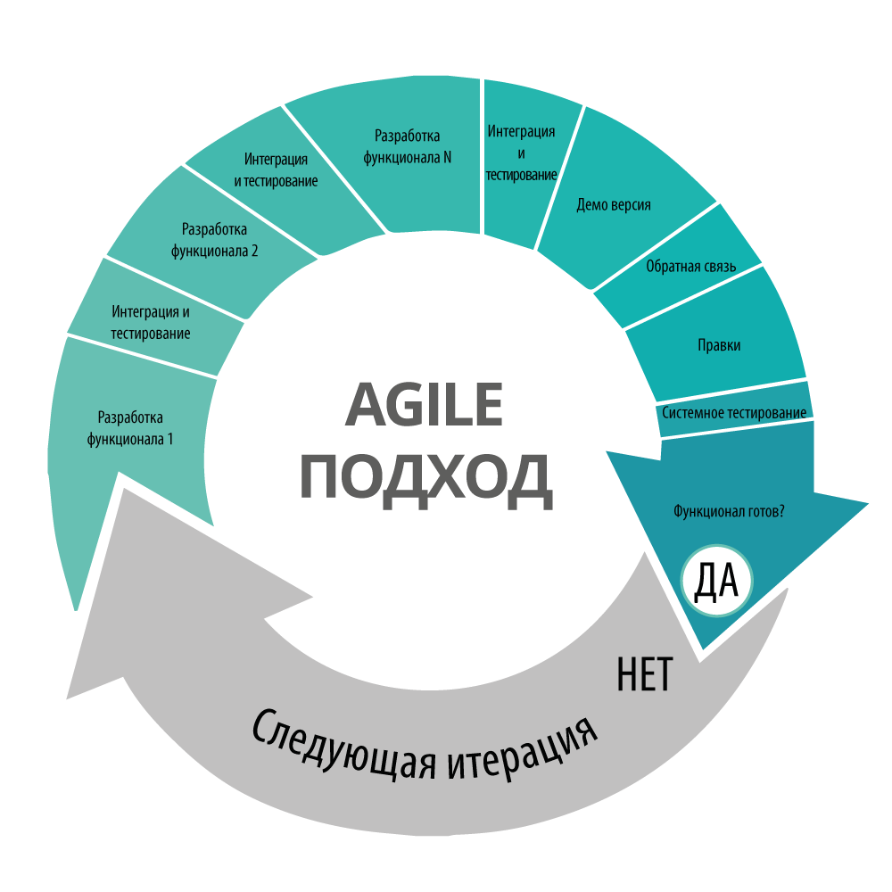
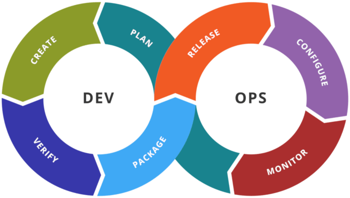
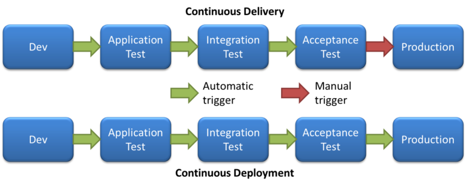

---

[На главную](/)

---

# Введение

## Agile и DevOps

Наша главная цель как разработчиков ПО — решить проблему, стоящую перед пользователями. Однако разрабатывать ПО всегда непросто, а найти правильное решение особенно сложно. Agile предлагает разбить разработку и доставку ПО на короткие циклы, чтобы упростить задачу. Благодаря этому легче получить обратную связь о том, что уже сделано, и учитывать ее в последующей работе.

Изначально Agile не определял конкретных инженерных методов, чтобы автоматизировать разработку ПО и предоставить обратную связь, поэтому из Agile выделилось отдельное движение за автоматизацию операций и функций инфраструктуры. Это движение и называется DevOps (development & operations).

DevOps предлагает методы сокращения циклов разработки и выпуска, тем самым сокращая и циклы обратной связи. DevOps основан на том принципе, что сложные вещи нужно делать как можно чаще: чем больше практики, тем проще с ними справиться. Идея заключается в том, чтобы не откладывать интеграцию до тех пор, когда весь код будет написан, а интегрировать его часто и небольшими порциями, каждый раз проводя автоматическое тестирование. Таким образом можно получить обратную связь вскоре после внесения изменений и сразу же устранить возникшие проблемы. Это в свою очередь повышает качество кода, потому что команда регулярно проверяет, все ли работает как надо, то есть тратит меньше времени на отладку и больше — на разработку новых функций.

### Реализация DevOps

Создание автоматического CI/CD-пайплайна позволяет реализовать принципы DevOps на практике. Непрерывная интеграция предполагает частые коммиты, то есть побуждает работать с небольшими порциями кода, которые быстро проходят пайплайн. Система автоматической сборки и тестирования позволяет проверить каждое изменение и получить обратную связь гораздо быстрее, чем при использовании ручного процесса.

Разработчику быстрая обратная связь помогает работать эффективнее, поскольку он лучше помнит контекст сделанных изменений в коде.

Автоматизация развертывания на предпроизводственных серверах повышает надежность и последовательность этого процесса и дает возможность использовать больше сред для тестирования и получения обратной связи. Регулярное развертывание небольших изменений в производственной среде вместо нерегулярных крупных релизов снижает риск ошибок, поскольку меньшее число переменных уменьшает вероятность непредвиденных и нежелательных последствий.

При возникновении ошибки ее проще и быстрее выявить и устранить благодаря меньшему объему кода. Наконец, пошаговый выпуск обновлений показывает пользователям, что вы постоянно работаете над улучшением ПО, и позволяет получить отклики на эти обновления, помогая определить дальнейшее направление работы, дополнительно повышая ценность продукта.

## Непрерывная интеграция (Continuous Integration)

Непрерывная интеграция, или, как ее часто называют, CI (Continuous integration), предполагает, что все, кто участвует в проекте разработки ПО, регулярно публикуют свои изменения в кодовой базе, а затем проверяют, работает ли код должным образом после каждого изменения. Непрерывная интеграция — ключевой элемент DevOps-подхода к разработке и выпуску программного обеспечения, который способствует совместной работе, автоматизации и быстрому получению обратной связи.

Внедрение непрерывной интеграции начинается с регулярной отправки изменений в систему управления версиями, чтобы все участники проекта работали с одинаковым кодом. Каждый коммит становится триггером для сборки и серии автоматизированных тестов, чтобы проверить поведение кода и убедиться, что изменение ничего не сломало. Непрерывная интеграция полезна и сама по себе, а еще она становится первым шагом к реализации CI/CD-пайплайна.

Основные элементы непрерывной интеграции:

* источник или система контроля версий с единой кодовой базой, включая файлы исходного кода, библиотеки, файлы конфигурации и скрипты;
* автоматизированные билд-скрипты;
* автоматизированные тесты;
* инфраструктура для выполнения сборки и тестов.

Чтобы все участники проекта работали с одинаковым кодом, они должны использовать один репозиторий и регулярно публиковать свои изменения. Практика показывает, что каждый участник должен отправлять изменения в основную ветку не реже раза в день.

Следующий шаг после отправки изменений — сборка решения и проведение автоматизированных тестов, чтобы проверить поведение кода. Автоматизация этого процесса — неотъемлемая часть непрерывной интеграции. Если сборка и тестирование осуществляются вручную, это отнимает много времени и может вести к ошибкам. В результате ежедневная интеграция изменений теряет смысл. Конкретные инструменты сборки и фреймворки тестирования зависят от рабочего языка программирования.

После настройки скриптов и тестов необходимо контролировать и при необходимости обновлять процесс. Сюда входит добавление автоматизированных тестов при появлении любых новых функций, устранение сбоев и отслеживание производительности.

## Непрерывная доставка и развёртывание (Continuous Delivery/Deployment)

### Непрерывная доставка

Непрерывная доставка – это следующий шаг CI/CD-пайплайна, который продолжает процесс непрерывной интеграции. При этом непрерывная доставка не является в полной мере автоматизацией процедуры релиза.

Задача непрерывной доставки — ускорить процесс разработки и сделать его более надежным, сокращая время на получение обратной связи и доставляя пользователю продукт быстрее, чем это позволяет ручной процесс. Как и в случае с непрерывной интеграцией, для реализации непрерывной доставки требуются три компонента DevOps: инструменты, процессы и культура.

При непрерывной доставке продукт всегда находится в «собранном» состоянии и готов к передаче в промышленную эксплуатацию, даже с учетом последних изменений, внесенных разработчиками в код. Скорее всего, непрерывная доставка будет реализована на основе тех же технологий, что и непрерывная интеграция.

### Непрерывной развёртывание

Именно в непрерывном развертывании DevOps-технология автоматизации сборки, тестирования и развертывания получила свое наибольшее логическое развитие. Если изменение успешно проходит все предыдущие стадии пайплайна, оно автоматически (без ручных вмешательств) попадает в конечное рабочее окружение. Непрерывное развертывание позволяет быстро доставлять пользователю новую функциональность и не жертвовать при этом качеством.

Непрерывному развертыванию предшествует стадия непрерывной интеграции и стадия непрерывной доставки.

Автоматизация финального выпуска в продакшн подойдет не всем проектам, но вам могут пригодиться отдельные шаги, реализующие непрерывное развертывание. Ключевым вопросом при планировании реализации непрерывного развертывания является то, как именно будут выпускаться изменения.

#### Канареечное развёртывание

Канареечное развертывание делает изменения доступными лишь для небольшой доли пользователей, делая их таким образом невольными тестировщиками системы в продакшне. Проследив их поведение и метрики использования, вы сможете убедиться, что ваш релизом не привнес новых ошибок, после чего можно будет выпустить обновление для остальных пользователей.

#### Сине-зеленое развертывание

Сине-зеленое развертывание распространено в организациях, использующих непрерывное развертывание, поскольку оно упрощает процедуру отката к предыдущей версии, необходимого на случай возникновения проблем: для этого старый код продолжает храниться в продакшне, пока вы не убедитесь, что все изменения работают должным образом. Если нужно, вы можете выполнить канареечное развертывание с последующим сине-зеленым выпуском.

Независимо от того, делаете ли вы сине-зеленое развертывание или выпускаете версии на замену, если вы хотите иметь возможность быстро реагировать на ошибки, проскользнувшие через процесс релиза, вам необходимо следить за состоянием системы в продакшне.

---

[Далее - SSH: защищённое соединение](/ci/ssh)
